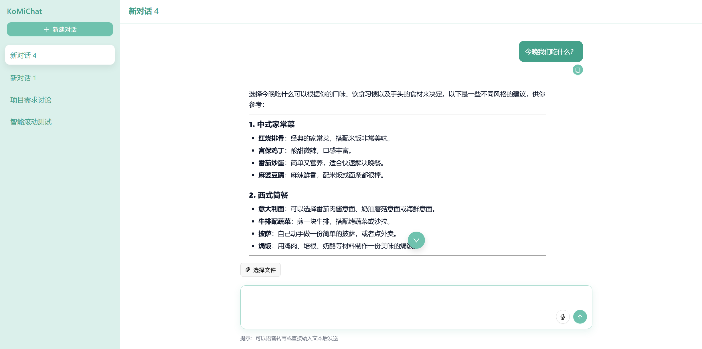
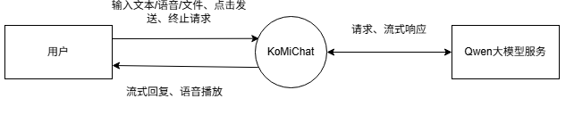
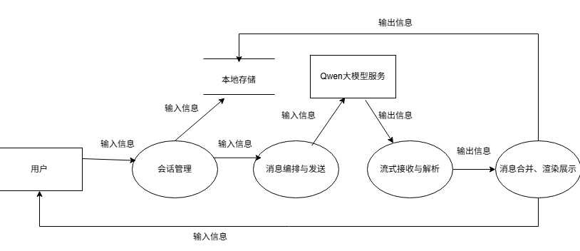
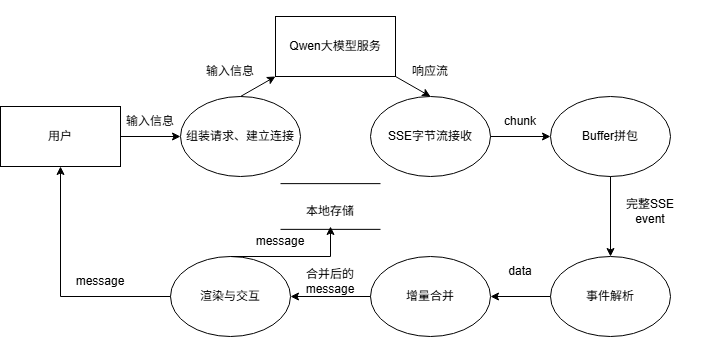

# KoMiChat

一个基于Qwen大模型的AI对话前端项目，尽可能贴近实际AI聊天产品，基本实现多对话列表、SSE流式输出、简单的SST和TTS已经智能滚动等AI对话产品的灵魂

## 预览

项目Page：https://yuannya0917.github.io/KoMiChat/



## Features

- SSE 流式输出
  - SSE 流式响应：模型在回复过程中边生成边展示，贴近 AI 对话的即时感
  - 增量渲染：每收到一个 chunk 就拼接到当前 assistant 消息，避免整段返回造成卡顿

- 聊天界面滚动体验
  - 智能滚动：接近底部时随流式输出自动滚动，用户上滑阅读历史时停止跟随
  - 长列表性能优化：使用懒加载优化历史消息加载，减少首屏加载时间

- 附件上传
  - 支持 txt/docx 格式文件上传

- STT（听写）和 TTS（朗读）
  - STT：使用 Web Speech Recognition 实现简单语音转写
  - TTS：使用 Web Speech Synthesis 实现简单朗读功能

## 技术栈

前端框架：React+TypeScript+Vite

UI组件：Ant Design

Markdown渲染与高亮：marked+highlight.js

XSS防护：DOMPurify

流式请求：Fetch+ReadableStream解析SSE

Mock：MSW

## Quick Start


## 密钥与环境变量


## 项目结构

```
KoMiChat/
├─ src/                      前端源码
│  ├─ features/chat/         聊天核心模块
│  │  ├─ api/                API 请求与 SSE 解析
│  │  ├─ components/         聊天 UI 组件
│  │  ├─ hooks/              会话控制和语音听写
│  │  ├─ model/              类型与模型定义
│  │  └─ services/           附件处理、消息拼装
│  ├─ pages/                 页面
│  ├─ mocks/                 MSW mock 配置
│  ├─ styles/                全局样式与变量
│  └─ types/                 全局类型声明
├─ qwen-proxy/               Cloudflare Worker 代理
├─ public/                   静态资源
└─ vite.config.ts            构建与开发配置
```

## Architecture（架构与数据流）

*DFD0*



*对话DFD*



*SSE解析DFD*




## 关键实现

- SSE分片处理：
  `qwenApi.http.ts`

    由于浏览器读取到的chunk可能会有断包的情况出现，于是项目使用了一个`buffer`缓冲区，遇到断包先拼到`buffer`上，若`buffer`中出现`\n\n`或`\r\n\r\n`，则对`buffer`裁剪出完整`data`，解析其中的增量文本，再通过`onDelta`回调函数将获取到的字符传给用户可见前端。解析失败时会用`onError`记录但不中断流。

- 增量消息更新：
  `qwenApi.http.ts` -(`onDelta`)-> `useChatController.ts`

  `generateAssistantReplyStream` 在解析到每个SSE event的增量文本后触发 `onDelta`；`useChatController` 在发送消息时先插入一条assistant占位消息，随后在`onDelta`回调里用 `setConversationMessages`精确定位这条占位消息，把 `delta`追加到AI回复上，从而实现边接收边渲染。

- 智能滚动：
  `ChatWindow.tsx`

  用一个`autoScrollEnabled`来决定新消息来时要不要滚到底，在滚动事件onScroll中实时计算dictanceToBottom=scrollHeight-scrollTop-clientHeight，即总高度-滚了多长-当前可视区域长度。distanceToBottom<=120px为true，此时认为用户在底部附近，消息更新时默认滚到最底。

- 消息列表懒加载：
  `ChatWindow.tsx`

  消息超过60条时，会启用懒加载，只渲染从visibleStartIndex开始的子数组。首次进入会话时默认展示最后40条。用户滚动到顶部附件时会触发懒加载加载更多，每次把visibleStartIndex往前移动20条。

- MSW Mock
  `mocks`
  为了更贴近实际业务的前后端交互，使用了MSW这个技术，在浏览器里用Service Worker拦截网络请求，返回自定义的响应，相当于一个假后端。

- 附件处理
  `ChatUpload.tsx` -> `useChatController.ts` -> `chatApi.http.ts` + `attachments.ts`

  目前只支持txt和docx格式的附件，发送消息时如果带附件，该项目会把文件内容提取成纯文本，再一起拼到本次用户消息里。txt文本会使用文件读取API来获取文本，docx使用mammoth来抽取纯文本。

- XSS 防护
  `AiMessage.tsx`

  渲染Markdown前后都做sanitize，避免注入危险标签；引入白名单策略，只允许有限的标签和属性；为了安全化渲染链路，先 marked 生成 HTML，再 DOMPurify.sanitize，最后才 dangerouslySetInnerHTML 输出，保证最终输出HTML已净化。